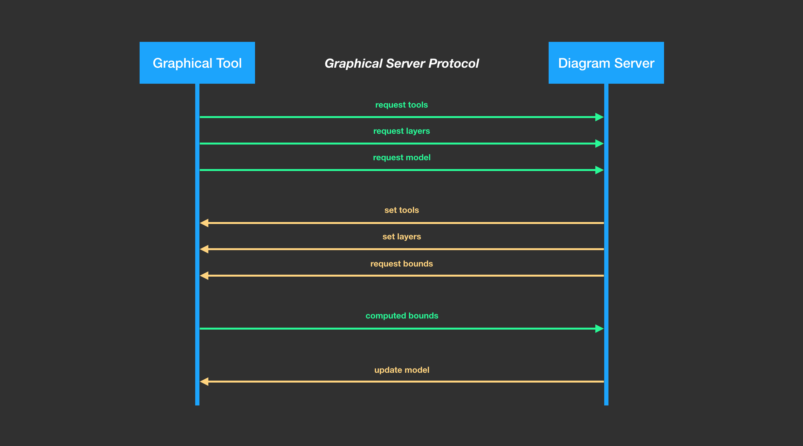
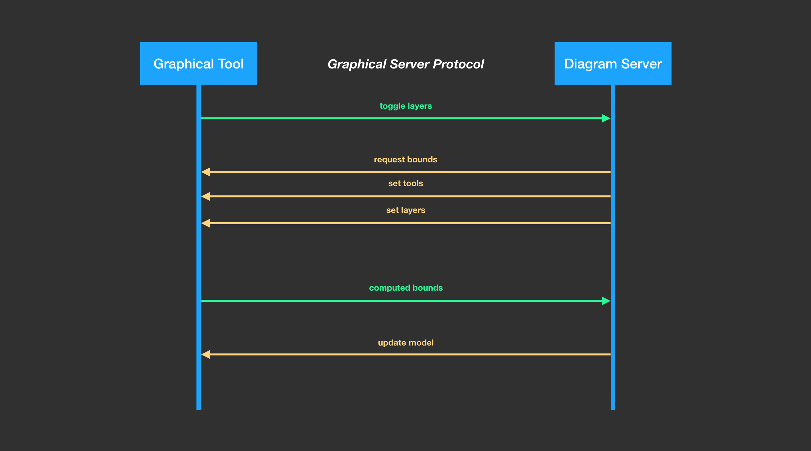
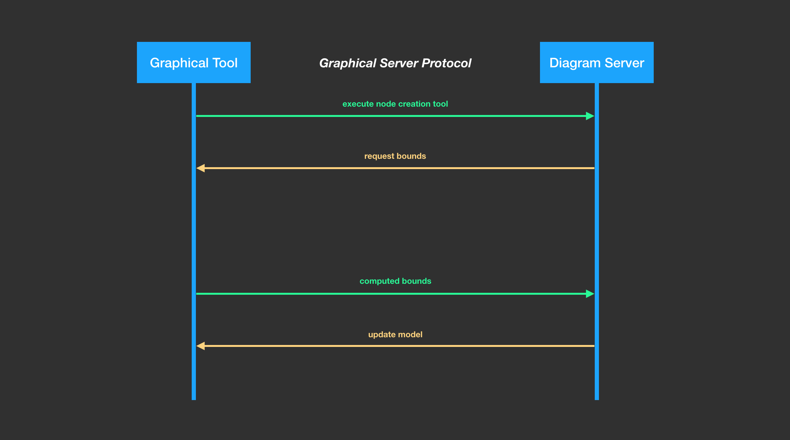

# Overview

## What is the graphical server protocol?

Building a full fledge graphical tooling to let users manipulate diagrams is a long and complex endavour.
Creating such tool for one platform is very expensive but supporting multiple platforms is not a viable option given the cost of integration in each platform.
The [graphical server protocol](specification.html) aims at dramatically lowering the cost of integrating a graphical tool in a platform by defining a platform agnostic protocol used to communicate between a platform and a graphical designer.
By implementing this [protocol](specification.html), a platform would gain the ability to reuse multiple designers while a tool creator would be able to deploy his product on multiple platforms easily.

## How it works

The [graphical server protocol](specification.html) is used by both the server running as a service in a process separated from the client. Both clients and server will exchange various messages to manipulate the diagram.

The server process can be used to manipulate various diagrams simultaneously. A client can be connected to multiple diagram servers too.

### Getting Started

When the client is started it will request the state of the palette and the diagram to the server. For that it will send a `RequestToolAction`, a `RequestLayerAction`and a `RequestModelAction`.

The server will start by responding with the active tools and layers. If the support for client-side layout is active, the server will ask the client to compute the bounds of the elements in order to create the layout. Once the server has sent a `RequestBoundsAction`, the client will compute the bounds and send back a `ComputedBoundsAction` to the server which will compute the real layout. Finally, the server will send the graphical model to be displayed to the client thanks to a `UpdateModelAction`.

### Using Layers

When a layer is toggled on or off, a `ToggleLayerAction` is sent to the server. The layer will compute the new state of the diagram and send back a `RequestBoundsAction` to help compute the layout as previously described and both a `SetToolsAction` and a `SetLayersAction`.

Both of these actions are sent by the server because activating a layer will have an impact on the state of the active tools and layers.

### Using Tools

When a tool is used by the client, an action is sent to the server to perform the behavior of the tool. For example, to create a new node, a `ExecuteNodeCreationToolAction` is used. The server will compute the new state of the diagram, asking the client for the bounds of the elements to display and it will also send the new status of the tools.

